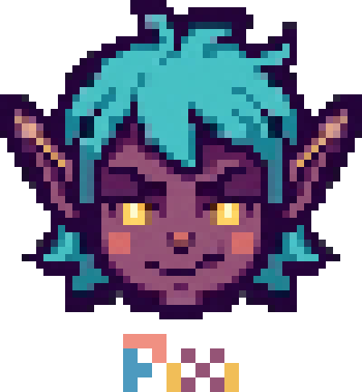

<div align="center">



# Workercise

**Pixi works out while Claude works.**

A [Claude Code](https://claude.com/claude-code) mod that rates how hard your prompt is with a locally hosted model,
then shows a pixel-art elf doing an exercise to match, until the turn is done.


*Easy prompt → neck rolls. Big prompt → burpees.*

</div>

---

## The idea

Agents take minutes. Staring at a spinner for those minutes is a waste of a perfectly good body.
Workercise reads your prompt, guesses how long the turn will take, and Pixi starts the workout that
fits: a typo fix gets a neck roll, a service migration gets burpees. When Claude finishes, Pixi stops.

Everything is local. The difficulty is rated by
[`torchcast-decision-12b`](https://huggingface.co/torchcast-ai/torchcast-decision-12b) running on your own machine, and every
frame is computed by a small procedural rig, not generated by an image model.

## The workouts

| | | | |
| :-: | :-: | :-: | :-: |
| <br>**1 · Neck rolls**<br><sub>front</sub> | <br>**2 · Arm circles**<br><sub>front</sub> | <br>**3 · Jumping jacks**<br><sub>front</sub> | <br>**4 · Sit-ups**<br><sub>side</sub> |
| <br>**5 · Squats**<br><sub>front</sub> | <br>**6 · Push-ups**<br><sub>side</sub> | <br>**7 · Burpees**<br><sub>side</sub> | |

## Quick start

You need [Claude Code](https://claude.com/claude-code), Node 18+, and a terminal that can draw images
(Ghostty, kitty, WezTerm or iTerm2; anything else gets a half-block fallback).

```sh
git clone https://github.com/Panoplos/Workercise.git
cd Workercise
sh tools/launch.sh              # starts the MLX model server if needed, then Claude Code with the mod
```

Already have a model server running? Point Claude Code at the mod directly:

```sh
claude --plugin-dir /path/to/Workercise
```

Then type a prompt. Pixi's pane opens when the turn starts and closes when Claude finishes, or when you
press <kbd>Esc</kbd> (<kbd>Ctrl</kbd>+<kbd>X</kbd> <kbd>X</kbd> closes it from anywhere). The line under Pixi shows the exercise,
the model's verdict (`difficulty 4/7 · ~35 min`), a rep counter and a clock.

No model yet? `node tools/mock-model.mjs` stands in for it (it rates by prompt length), and
`node tools/player.mjs` previews the animations without Claude Code at all (<kbd>←</kbd>/<kbd>→</kbd> switch exercise, <kbd>q</kbd> quits).

## How it works

```
 prompt ──► guess from length + wording ──► Pixi starts immediately
   │
   └─────► System One scores 1–7 (~0.4 s) ──► Pixi switches exercise when the verdict lands
                                                         │
 turn.complete / Esc ◄───────────────────────────────────┘ pane closes
```

Workercise is a Claude Code **mod**: function hooks that run inside Claude Code.

| Event | What it does |
| :- | :- |
| `prompt.submit` | Guesses the difficulty, asks the local model, opens the pane |
| `turn.complete` | Closes the pane |
| `ui.close` | Notices <kbd>Esc</kbd> / <kbd>Ctrl</kbd>+<kbd>X</kbd> <kbd>X</kbd> |
| `ui.render` (Pane) | Draws the current frame and the status line, sized to the pane |
| `$.clock.every` | Repaints the sprite in place at 12 fps |

The estimate is fire-and-forget. If the model is down, Pixi works out anyway on the guess, and a stale
verdict for an earlier prompt never overrides a newer one.

## The model: System One

`torchcast-ai/torchcast-decision-12b` is not a chat model. It is a typed decision model (a Gemma 4 12B
fine-tune): each decision is one forward pass that reads the probability of every option letter at the
answer slot. Workercise asks it one `score` question over seven levels and reads a distribution, which gives
the exercise (the likeliest level), a confidence and the expected minutes (`difficulty 4/7 (72%) · ~40 min`).

Two ways to reach it, chosen by the URL (`/config` → *LLM endpoint*, or the env below):

- **`…/v1/systemone`**: the authors' shim (vLLM on an NVIDIA box). The shim does the readout.
- **Any OpenAI-compatible chat endpoint that returns logprobs**: `mlx_lm.server`, `llama-server`, vLLM.
  The mod renders the shim's prompt scaffolding, asks for one token with `top_logprobs`, and sums the mass
  per letter itself. This is the path for a Mac.

```sh
THINKERCISE_LLM_URL=http://localhost:8080/v1/chat/completions \
THINKERCISE_LLM_MODEL=torchcast-decision-12b \
claude --plugin-dir /path/to/Workercise
```

### Running it on a Mac with MLX

No MLX conversion is published, but mlx-lm (≥ 0.32) loads this `gemma4_unified` checkpoint. The download is
22 GB; the 8-bit weights come to ~12.5 GB and keep the readout's calibration closer than 4-bit would.

```sh
sh tools/mlx-convert.sh        # venv + mlx-lm, download, patch the config, convert
~/.thinkercise-mlx/bin/mlx_lm.server --model ~/models/torchcast-decision-12b-8bit --port 8080
```

<details>
<summary>Why the script patches the config</summary>

A plain `mlx_lm.convert --hf-path torchcast-ai/torchcast-decision-12b` fails with
`Expected shape (4096, 3840) but received shape (512, 3840)`: the checkpoint's `config.json` omits
`num_global_key_value_heads` (1) and `global_head_dim` (512), which Gemma 4's full-attention layers need and
which mlx-lm otherwise guesses as 8 heads. The script stages the files with a patched config and converts from there.

</details>

Alternative with no conversion: `brew install llama.cpp`, then
`llama-server -hf mradermacher/torchcast-decision-12b-GGUF:Q8_0 --port 8080` (11.8 GB).

**Latency.** A decision costs ~100 ms fixed plus ~1.1 ms per prompt token (~900 tokens/s of prefill). The mod
warms the server at session start and keeps context short, so a fresh prompt is rated in about half a second.
Verdicts measured on an M5 Pro with the 8-bit weights are monotonic across the scale.

Check it end to end:

```sh
node tools/ask.mjs "refactor the auth module across three services"
```

prints the distribution over the seven levels, the verdict and the response time.

## It tunes itself

Every turn the mod records one JSON file under `~/.thinkercise/decisions/` (switch it off with
`Record decisions` in `/config` or `THINKERCISE_LOG_DIR=off`): the prompt, the recent context, the verdict
and what the turn really cost (measured duration, tool calls, tokens). A turn's real duration, bucketed at
1, 3, 8, 20, 45 and 120 minutes, is the target level.

`hooks/config.js` holds every knob the model's protocol leaves open: the question's wording, the level
descriptions, minutes per level, context size, the decision rule. `tools/eval/hillclimb.mjs` climbs them:

```sh
node tools/eval/hillclimb.mjs                      # dry run on the logged turns
node tools/eval/hillclimb.mjs --mutate 4 --apply   # let Claude propose wordings; write the winner
```

The fitness is the ranked probability score of the level distribution against the target, a proper scoring
rule, so it rewards mass near the truth and penalises confidence that isn't earned. Candidates are accepted
only when they win on the whole set and on three of four folds, and every attempt lands in
`~/.thinkercise/ledger.jsonl`. Readouts are cached, so numeric knobs are free to try.

`tools/eval/context.mjs` scores context policies against hand-labelled prompts. On the author's own
transcripts the policy the mod ships (the last *spoken* exchange, 300 characters each) agreed with the labels
at ρ ≈ 0.8, with 75–81 % of verdicts within one level.

## The animation

Every frame is computed, so position, size and timing are exact across frames and exercises.

- **The head** is lifted pixel for pixel from the logo (`tools/pixi-logo.png`, an 8 px grid) into
  `hooks/head.js`. It only moves by transforms that keep it crisp: whole-row shears, a RotSprite-style
  rotation, and a one-pixel hair-cap bounce. Expressions (eyes, mouths, sweat, sparks, puffs) are overlays
  in the logo's own palette, keyed to each exercise's effort.
- **The body** is a jointed rig (torso, two-bone arms and legs) rasterised at 128 × 128 with a 1 px outline,
  a shade band and a rim light. The tunic has a V-neck trim, sleeve hems, a buckled belt and a hip pouch;
  hands are fists, open hands or flat palms depending on the pose; boots have a shaft, toe cap and sole line.
  Planted hands and feet are IK targets, so floor contact is exact.
- **Clips** are functions of time with eased keyframes, anticipation, squash on landings and holds.
  10–36 frames per cycle at 12 fps.

Two renderers are picked at run time. **True pixels** (`Image`) draws the pre-rendered 1024 × 1024 PNGs in
`assets/frames`, scaled by the terminal itself. If the terminal refuses the first blit, the mod falls back to
**half-block cells** (`Raster`), rendering the same frames into `▀`/`▄` cells. Force one with
`THINKERCISE_RENDERER=image|raster`.

```sh
node tools/render.mjs                       # frames → assets/frames (and the checks)
node tools/render.mjs --sheets /tmp/sheets  # plus a contact sheet per exercise
node tools/make-gifs.mjs                    # the GIFs in this README → docs/gifs
node tools/extract-head.mjs                 # regenerate hooks/head.js from the logo
```

`render.mjs` fails if any IK target is out of reach or a drawing touches the canvas edge, so a clip edit
cannot ship a frame where a foot floats or an ear is cut off.

## Configuration

Set these in Claude Code's `/config`:

| Setting | Default | What it does |
| :- | :- | :- |
| LLM endpoint | `http://localhost:8080/v1/chat/completions` | Where the model lives |
| LLM model | `torchcast-ai/torchcast-decision-12b` | Model name sent to it |
| Pane width (docked) | 56 | Columns when docked beside the transcript |
| Pane height (inline) | 22 | Rows when above the prompt (capped at a third of the terminal) |
| Cell aspect ratio | 0.5 | Cell width ÷ height, so the sprite comes out square (0.43 for Iosevka) |
| Record decisions | on | Keep verdicts and turn costs for tuning |

## Project layout

```
hooks/            the mod: register.js (events + UI), pixi.js (rig + clips), head.js, estimate.js, config.js
assets/frames/    pre-rendered 1024 px frames per exercise
docs/gifs/        README animations
tools/            render, player, model checks, MLX conversion, eval + hill-climbing
tests/            the mod driven with stubbed network and UI
```

## Verify

```sh
claude plugin validate .
claude plugin test
```

The tests drive the mod with stubbed network and UI: a prompt opens the pane with the right size; the image
path names the right frame for a verdict; difficulty 7 is burpees; the raster renderer packs half-block
cells; a dead model leaves the guess in place; a late verdict for an older prompt is ignored; `turn.complete`
closes the pane.

## License

[MIT](LICENSE)
