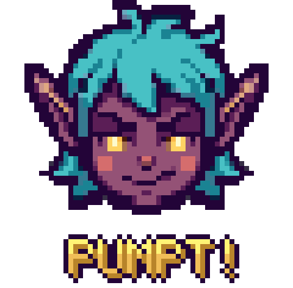
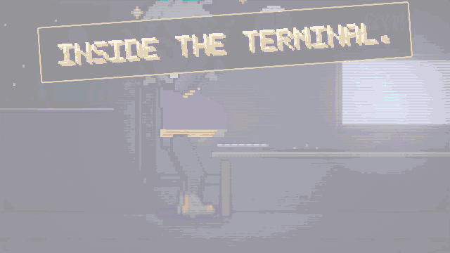
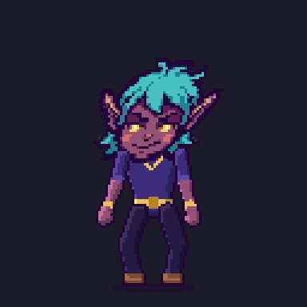
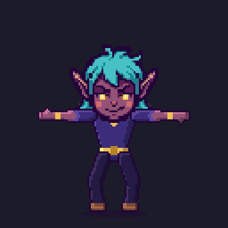
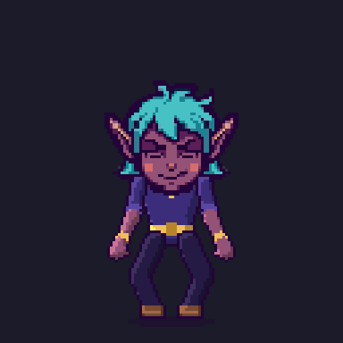
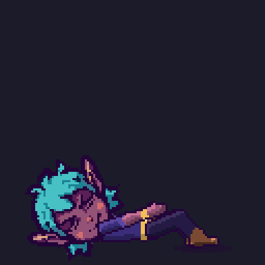
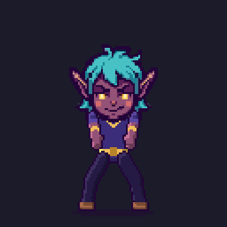
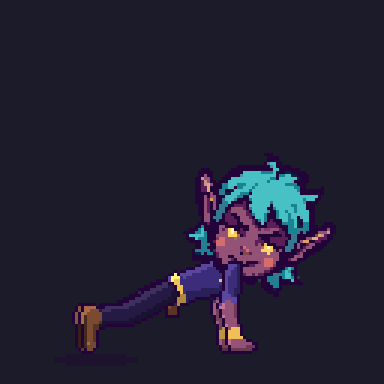
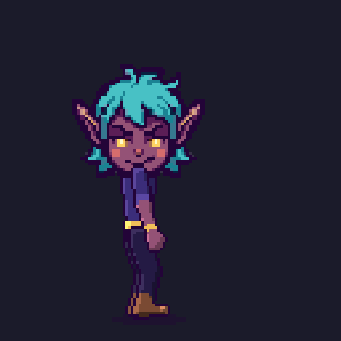
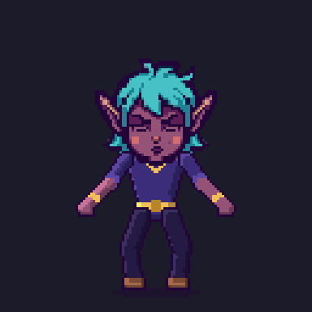

<div align="center">



**You work out while Claude works.**

A [Claude Code](https://claude.com/claude-code) mod that rates how hard your prompt is with a model on your own machine,
then puts a pixel-art coach above your prompt doing the exercise to match. Do the reps with him until the turn is done.


<!-- To get a real player here: open this README in GitHub's web editor, drag docs/pumpt-720p.mp4
     into it, and paste the github.com/user-attachments/... URL it gives you on a line of its own
     in place of the image below. GitHub only renders a player for uploaded attachments. -->
<a href="docs/pumpt-720p.mp4"></a>

*Easy prompt → neck rolls. Big prompt → burpees. Finish the set → take a bow.*

*[Watch the full 64-second video](docs/pumpt-720p.mp4) · the story of why Pixi built it.*

</div>

---

## The idea

Agents take minutes. You spend those minutes staring at a spinner, or scrolling. Meanwhile you have a
perfectly good body sitting in that chair.

Pumpt! reads your prompt, estimates how long the turn will take, and gives you a set that fits: a typo fix
gets you neck rolls, a service migration gets you burpees. Pixi, your pixel-art coach, does the reps above
your prompt and counts them; you do them beside the desk. When Claude is done, so are you. Finish the set
first and you take a bow.

Everything runs on your machine. The difficulty comes from
[`torchcast-decision-12b`](https://huggingface.co/torchcast-ai/torchcast-decision-12b), a System One decision model
served locally, and every frame of the coach is computed by a small procedural rig, not generated by an image model.

## The workouts

| | | | |
| :-: | :-: | :-: | :-: |
| <br>**1 · Neck rolls**<br><sub>a set of 20</sub> | <br>**2 · Arm circles**<br><sub>a set of 40</sub> | <br>**3 · Jumping jacks**<br><sub>a set of 50</sub> | <br>**4 · Sit-ups**<br><sub>a set of 30</sub> |
| <br>**5 · Squats**<br><sub>a set of 25</sub> | <br>**6 · Push-ups**<br><sub>a set of 20</sub> | <br>**7 · Burpees**<br><sub>a set of 12</sub> | <br>**The bow**<br><sub>after any set</sub> |

Every set opens the same way: a **READY?** card holds for a beat while the model decides (so the title
never names the wrong exercise), then your exercise's name balloons in, arcade-style, swells and pops in a
burst of confetti, and there's your coach in the opening pose. Get up. A set you finish ends with a leap, a
landing and a **GOOD JOB!**; a turn that ends first just clears the band, and you sit back down.

## Quick start

You need [Claude Code](https://claude.com/claude-code), Node 18+, and a terminal that can draw images
(Ghostty, kitty, WezTerm or iTerm2; anything else gets a half-block fallback).

```sh
git clone https://github.com/Panoplos/Pumpt.git
cd Pumpt
sh tools/launch.sh              # starts the MLX model server if needed, then Claude Code with the mod
```

Already have a model server running? Point Claude Code at the mod directly:

```sh
claude --plugin-dir /path/to/Pumpt
```

Then type a prompt. Your coach appears in the band just above it when the turn starts, drawn straight
over the terminal's background (no frame, no dock), and leaves when Claude finishes, or when your set is
done and the bow is taken. The line under him shows your exercise, the model's verdict
(`difficulty 4/7 · ~4 min`), your reps (`12/30 reps`) and a clock.
<kbd>Ctrl</kbd>+<kbd>X</kbd> <kbd>Ctrl</kbd>+<kbd>A</kbd> collapses the band if you need the rows back.

No model yet? `node tools/mock-model.mjs` stands in for it (it rates by prompt length), and
`node tools/player.mjs` previews the animations without Claude Code at all (<kbd>←</kbd>/<kbd>→</kbd> switch exercise, <kbd>q</kbd> quits).

## How it works

```
 your prompt ──► guess from length + wording ──► the title balloons in, pops: your set starts
   │
   └─────► System One scores 1–7 (~0.4 s) ──► the title changes its name mid-zoom if the verdict differs
                                                         │
 turn.complete ◄───────────────────────────────┬─────────┘ the coach leaves the band
 you finish the set ──► a leap, a landing, GOOD JOB! ┘
```

Pumpt! is a Claude Code **mod**: function hooks that run inside Claude Code.

| Event | What it does |
| :- | :- |
| `prompt.submit` | Guesses the difficulty, asks the local model, starts the intro in the band |
| `turn.complete` | Clears the band (a subagent's turn ending doesn't count) |
| `ui.render` (AbovePrompt) | Draws the current frame and the status line, sized to the band; yields to a survey |
| `$.clock.every` | Repaints the sprite in place at 12 fps and runs the set: intro → reps → outro → an empty band |

The band sits directly above the prompt, so the sprite's transparent pixels show your terminal background
through them; the half-block fallback leaves empty cells in the terminal's own colour for the same effect.
It takes real rows (14 by default, plus the status line), so the transcript scrolls up by that much while
you work out.

The estimate is fire-and-forget. If the model is down, you still get a set from the guess, and a stale
verdict for an earlier prompt never overrides a newer one.

## The model: System One

`torchcast-ai/torchcast-decision-12b` is not a chat model. It is a typed decision model (a Gemma 4 12B
fine-tune): each decision is one forward pass that reads the probability of every option letter at the
answer slot. Pumpt! asks it one `score` question over seven levels and reads a distribution, which gives
your exercise (the likeliest level), a confidence and the expected minutes (`difficulty 4/7 (72%) · ~4 min`).
The minutes are the geometric expectation over a table that runs from half a minute at level 1 to an hour
at level 7, so a few percent of probability on the top level cannot swamp a trivial prompt's estimate.

Two ways to reach it, chosen by the URL (`/config` → *LLM endpoint*, or the env below):

- **`…/v1/systemone`**: the authors' shim (vLLM on an NVIDIA box). The shim does the readout.
- **Any OpenAI-compatible chat endpoint that returns logprobs**: `mlx_lm.server`, `llama-server`, vLLM.
  The mod renders the shim's prompt scaffolding, asks for one token with `top_logprobs`, and sums the mass
  per letter itself. This is the path for a Mac.

```sh
PUMPT_LLM_URL=http://localhost:8080/v1/chat/completions \
PUMPT_LLM_MODEL=torchcast-decision-12b \
claude --plugin-dir /path/to/Pumpt
```

### Running it on a Mac with MLX

No MLX conversion is published, but mlx-lm (≥ 0.32) loads this `gemma4_unified` checkpoint. The download is
22 GB; the 8-bit weights come to ~12.5 GB and keep the readout's calibration closer than 4-bit would.

```sh
sh tools/mlx-convert.sh        # venv + mlx-lm, download, patch the config, convert
~/.pumpt-mlx/bin/mlx_lm.server --model ~/models/torchcast-decision-12b-8bit --port 8080
```

<details>
<summary>Why the script patches the config</summary>

A plain `mlx_lm.convert --hf-path torchcast-ai/torchcast-decision-12b` fails with
`Expected shape (4096, 3840) but received shape (512, 3840)`: the checkpoint's `config.json` omits
`num_global_key_value_heads` (1) and `global_head_dim` (512), which Gemma 4's full-attention layers need and
which mlx-lm otherwise guesses as 8 heads. The script stages the files with a patched config and converts from there.

</details>

Alternative with no conversion: `brew install llama.cpp`, then
`llama-server -hf mradermacher/torchcast-decision-12b-GGUF:Q8_0 --port 8080` (11.8 GB).

**Latency.** A decision costs ~100 ms fixed plus ~1.1 ms per prompt token (~900 tokens/s of prefill). The mod
warms the server at session start and keeps context short, so a fresh prompt is rated in about half a second.
Verdicts measured on an M5 Pro with the 8-bit weights are monotonic across the scale.

Check it end to end:

```sh
node tools/ask.mjs "refactor the auth module across three services"
```

prints the distribution over the seven levels, the verdict and the response time.

## It tunes itself

Every turn the mod records one JSON file under `~/.pumpt/decisions/` (switch it off with
`Record decisions` in `/config` or `PUMPT_LOG_DIR=off`): the prompt, the recent context, the verdict,
what the turn really cost (measured duration, tool calls, tokens), and which renderer drew the coach with any
blit the terminal refused, so a fallback to cells can be diagnosed after the fact. A turn's real duration, bucketed at
0.75, 1.5, 3.5, 8, 20 and 45 minutes, is the target level. The minutes table itself is refit from the
logged durations (the median turn at each level, shrunk toward the current table) and judged on the
minutes log-error, since it cannot move the level distribution.

`hooks/config.js` holds every knob the model's protocol leaves open: the question's wording, the level
descriptions, minutes per level, context size, the decision rule. `tools/eval/hillclimb.mjs` climbs them:

```sh
node tools/eval/hillclimb.mjs                      # dry run on the logged turns
node tools/eval/hillclimb.mjs --mutate 4 --apply   # let Claude propose wordings; write the winner
```

The fitness is the ranked probability score of the level distribution against the target, a proper scoring
rule, so it rewards mass near the truth and penalises confidence that isn't earned. Candidates are accepted
only when they win on the whole set and on three of four folds, and every attempt lands in
`~/.pumpt/ledger.jsonl`. Readouts are cached, so numeric knobs are free to try.

`tools/eval/context.mjs` scores context policies against hand-labelled prompts. On the author's own
transcripts the policy the mod ships (the last *spoken* exchange, 300 characters each) agreed with the labels
at ρ ≈ 0.8, with 75–81 % of verdicts within one level.

## The animation

Every frame is computed, so position, size and timing are exact across frames and exercises.

- **The head** is lifted pixel for pixel from the logo (`tools/pixi-logo.png`, an 8 px grid) into
  `hooks/head.js`. It only moves by transforms that keep it crisp: whole-row shears, a RotSprite-style
  rotation, and a one-pixel hair-cap bounce. Expressions (eyes, mouths, sweat, sparks, puffs) are overlays
  in the logo's own palette, keyed to each exercise's effort.
- **The body** is a jointed rig (torso, two-bone arms and legs) rasterised at 128 × 128 with a 1 px outline,
  a shade band and a rim light. The tunic has a V-neck trim, sleeve hems, a buckled belt and a hip pouch;
  hands are fists, open hands or flat palms depending on the pose; boots have a shaft, toe cap and sole line.
  Planted hands and feet are IK targets, so floor contact is exact.
- **Clips** are functions of time with eased keyframes, anticipation, squash on landings and holds.
  10–36 frames per cycle at 12 fps. Each exercise carries the size of a set (12 burpees, 40 arm circles);
  when the reps are done the outro plays and the band empties.
- **The titles** are a 5×7 bitmap font drawn the arcade way: scaled, lit along the top, extruded two
  pixels down-right and outlined, so "SQUATS" reads as a slab. The intro zooms it in with an overshoot,
  swells it for two frames and pops it: a white-silhouette flash, a shockwave ring and a burst of confetti
  on their own little physics (drag, gravity, a tumble), with the coach revealed in the exercise's first pose so
  the workout cuts in without a seam. The outro is a leap with sparks at the apex, a squashed landing into
  a wide "ta-da" squat, **GOOD JOB!** slamming in overhead and confetti raining through the hold.

Two renderers are picked at run time. **True pixels** (`Image`) draws the pre-rendered 1024 × 1024 PNGs in
`assets/frames`, scaled by the terminal itself. If the terminal keeps refusing the picture for a second, the
mod falls back to **half-block cells** (`Raster`), rendering the same frames into `▀`/`▄` cells, and the
status line ends in `· cells`; the next prompt tries the PNGs again. Force one with
`PUMPT_RENDERER=image|raster`.

```sh
node tools/render.mjs                       # frames → assets/frames (and the checks)
node tools/render.mjs --sheets /tmp/sheets  # plus a contact sheet per clip
node tools/make-gifs.mjs                    # the GIFs in this README → docs/gifs
node tools/make-gifs.mjs --set squats       # one GIF of a whole set: intro, two reps, the bow
node tools/extract-head.mjs                 # regenerate hooks/head.js from the logo
```

`render.mjs` fails if any IK target is out of reach or a drawing touches the canvas edge, so a clip edit
cannot ship a frame where a foot floats or an ear is cut off.

## Configuration

Set these in Claude Code's `/config`:

| Setting | Default | What it does |
| :- | :- | :- |
| LLM endpoint | `http://localhost:8080/v1/chat/completions` | Where the model lives |
| LLM model | `torchcast-ai/torchcast-decision-12b` | Model name sent to it |
| Sprite height | 14 | Rows the sprite takes above the prompt (capped at what the band can show whole) |
| Status line | on | The line under the coach: exercise, verdict, reps, clock. Off gives the sprite that row |
| Cell aspect ratio | 0.5 | Cell width ÷ height, so the sprite comes out square (0.43 for Iosevka) |
| Record decisions | on | Keep verdicts and turn costs for tuning |

## Project layout

```
hooks/            the mod: register.js (events + UI), pixi.js (rig + clips), head.js, estimate.js, config.js
assets/frames/    pre-rendered 1024 px frames per clip: each exercise, its intro, the outro
docs/gifs/        README animations
tools/            render, player, model checks, MLX conversion, eval + hill-climbing
tests/            the mod driven with stubbed network and UI
```

## Verify

```sh
claude plugin validate .
claude plugin test
```

The tests drive the mod with stubbed network and UI: a prompt puts a sprite of the right size in the band,
opening on the intro, and it never outgrows a short band; the image path names the right frame for a
verdict; difficulty 7 is burpees; a whole set of push-ups runs through the intro, 20 reps, the bow and an
empty band, frame-exact; the raster renderer packs half-block cells on the terminal's own background; a
dead model leaves the guess in place; a late verdict for an older prompt is ignored; a survey gets the band;
a subagent finishing doesn't end the workout; `turn.complete` clears the band.

## License

[MIT](LICENSE)
